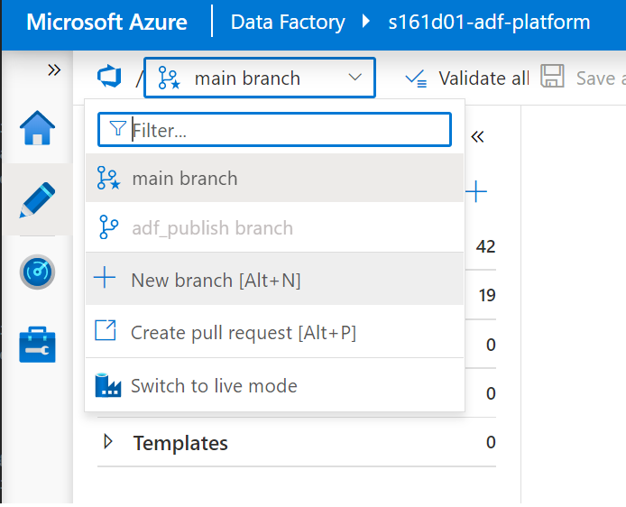
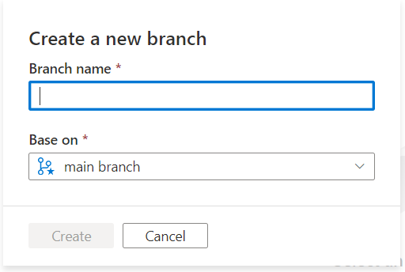

# Introduction

This Solution provides a CICD for the Data Engineering Data Factory solution. the ADF solution is maintained within ADF native Repository management feature. Merges into the main branch will initiate a deployment to the DevTest environment

# Getting Started

There are some prerequisites & build consider before running this project

1. As mentioned, the ADF repo features handles management of the source code
2. At the time of writing the default databricks solution is sitting within [Dev ADF](https://adf.azure.com/en/authoring?factory=%2Fsubscriptions%2F81703de1-ec12-47e5-91f8-ef521199196e%2FresourceGroups%2Fs161d01-rg-odp%2Fproviders%2FMicrosoft.DataFactory%2Ffactories%2Fs161d01-adf-platform)
3. Developers are advised to branch off the main code 

   opens to

   

4. Regularly perform commits of your OWN Branch
5. Having a single moderator to merge branches to Main will minimise conflicts

# Build Settings

1. Installation process

2. create SPN on azureportal (1 for every envorinment that you deploy to)
   [S161-ESFA-Adopt](https://dfe-ssp.visualstudio.com/S161-ESFA-Adopt/)

- Navigate to the Settings window

  

- click through to Service Connection  
  
- these are the environments currently used Dev, DevTest, Test, Prod
  

3. the SPN's are associated to each deployment which need to be set in the azure-pipline.yml
4. the main branch holds the latest code
5. to initiate a CICD one must create a "feature" or "release" branch which in doing so automatically triggers the deployment process
6. setup the DevOps groups Vairables in the Library. the variable group used in this solution is vg-odin-core
7. setup the ADF paramaters using the files below. as a general guideline, the static datasources must be repointed their respected enviornments

- [arm-template-parameters-devtest.json](/azuredatafactory/src/arm-template-parameters-devtest.json)
- [arm-template-parameters-test.json](/azuredatafactory/src/arm-template-parameters-test.json)
- [arm-template-parameters-prod.json](/azuredatafactory/src/arm-template-parameters-prod.json)
  - dynamic paramters that are set to populated the template are. this can be extended -[subscriptionId] -[env]
  - the overrides occur during the azure-build.yml step
- There is a final override that supersedes these paramater which is applied in azure-deploy.yml

8. setup requires that once the datafactory is released, the User Assigned Managed Identy [s161...-uami-adf-platform] used by the ADF needs to be added to the Read Group (s161-ESFADataScience-Reader USR)

9. setup requires that the User Assigned Managed Identy [s161...-uami-adf-platform] has contributor access to the PlatformDB. Perform this in the [IAM](https://portal.azure.com/#@platform.education.gov.uk/resource/subscriptions/81703de1-ec12-47e5-91f8-ef521199196e/resourceGroups/s161d01-rg-ODP/users)

10. if you are deploying a new ADF to an enviornment, the solution might not add the global paramter to the enviornment. you must do this manually

\*\*NOTE

- if the databricks projects, redeploys the [s161...-ODP-DBR-DE-WS] through the CICD, you must update the [arm-template-parameters-devtest.json] file for [LS_DBR_properties_typeProperties_existingClusterId] which is the newly created cluster id
